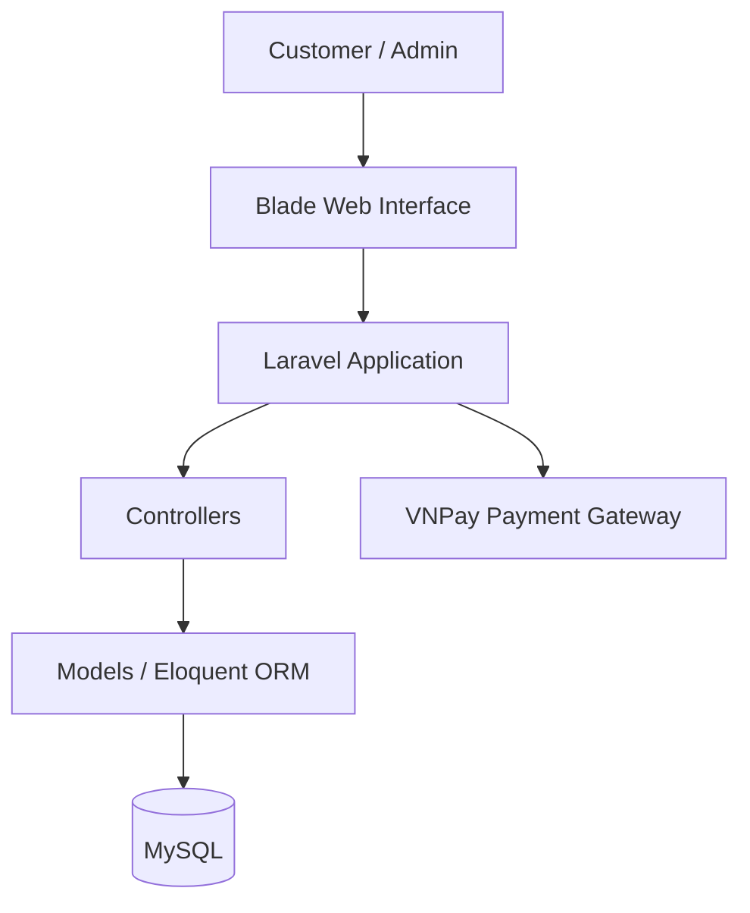
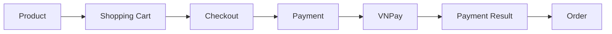
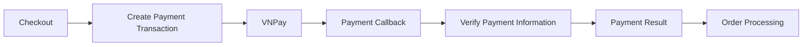

# HP Sneakers Store

HP Sneakers Store is a web-based e-commerce application for selling sneakers. The
project focuses on the core business workflows of an online sneaker store using
Laravel and MySQL.

## Table of Contents

- [Overview](#overview)
- [Business Scope](#business-scope)
- [System Architecture](#system-architecture)
- [Technology Stack](#technology-stack)
- [Core Business Workflows](#core-business-workflows)
- [Backend Structure](#backend-structure)
- [Key Engineering Features](#key-engineering-features)
- [Database Design](#database-design)
- [Testing](#testing)
- [Business Analyst Documentation](#business-analyst-documentation)
- [Project Improvement Direction](#project-improvement-direction)

## Overview

The system supports two main user roles:

- **Customer:** Browse products, search products, manage the shopping cart, place
	orders, make payments, and view order information.
- **Admin:** Manage products, categories, inventory, orders, and other store
	operations.

## Business Scope

The main business areas include:

- Product management
- Category management
- Inventory management
- Shopping cart
- Order management
- Payment
- Customer management
- Admin management

The system covers the main customer purchasing process, from product browsing to
checkout and payment.

## System Architecture

The current system follows a traditional Laravel web application architecture:

## Technology Stack

| Area | Technologies |
| --- | --- |
| Backend | PHP, Laravel |
| Frontend | Blade, HTML, Tailwind CSS, JavaScript |
| Database | MySQL, Eloquent ORM |
| External services | VNPay |
| Development tools | Composer, Vite, Git / GitHub, Laravel Sail |
| Testing | Pest / PHPUnit |

## Core Business Workflows

### Customer Purchase Flow

The system creates and processes the order as part of the purchasing workflow and
updates inventory after a successful purchase.

### Inventory Management

The project contains inventory-related transaction handling for maintaining
inventory records.

### Payment Flow

The backend verifies the VNPay response before processing the payment result.

### Order Management

Customers can create and view orders, while administrators can manage order
information and update order status. The system separates customer-side
purchasing operations from administrator-side order management.

## Backend Structure

The backend is implemented using Laravel's MVC architecture:

- **Controllers** handle HTTP requests and application flow.
- **Models** represent business entities and database relationships.
- **Eloquent ORM** handles database operations.
- **Middleware** provides authentication and access control.
- **Laravel validation** validates user input.
- **Database transactions** protect critical operations that involve multiple
	database changes.

## Key Engineering Features

- VNPay payment integration
- Payment response verification
- Inventory transaction management
- Database transaction handling
- Product and product-size management
- Order and order-item management
- Authentication and authorization
- Input validation
- Shopping cart management
- Admin management functionality

These features represent the core technical and business logic of the current
system.

## Database Design

The system uses MySQL as its relational database. Major entities include:

- User
- Product
- Product size
- Category
- Cart
- Order
- Order item
- Inventory transaction
- VNPay transaction
- Address

Relationships between these entities support product management, purchasing,
inventory, order processing, and payment.

## Testing

The project includes a Laravel testing environment based on the Pest/PHPUnit
testing stack. The setup is intended to support automated testing of application
functionality and business logic.

## Business Analyst Documentation

The project includes Business Analyst documentation covering the system and its
requirements. The documentation includes:

- System overview
- Functional requirements
- Business rules
- Use cases
- Activity diagrams
- BPMN
- System analysis

See the [Business Analyst documentation](docs/business_analyst/README.md) for
more information.

## Project Improvement Direction

The current project provides the basic foundation of an e-commerce system.
Future improvements will focus on business problems identified through the
AS-IS-to-TO-BE analysis, including:

- Reducing manual inventory operations
- Improving inventory data validation
- Improving inventory consistency
- Preventing overselling
- Strengthening order lifecycle control
- Improving payment reliability
- Improving product search
- Increasing automated test coverage

These improvements will be implemented based on business requirements and system
constraints rather than adding technologies without a clear purpose.